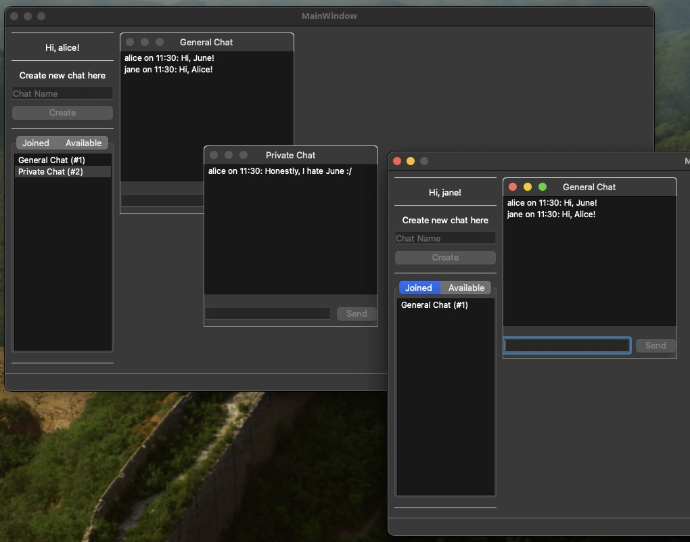

# PHP Chat Project

A simple full-stack chat system:

- **Backend:** RESTful API built with PHP (Slim), SQLite, Redis
- **GUI:** Desktop app built with PyQt6
- **Broker:** Redis pub/sub for real-time updates
- **Server:** NGINX reverse proxy



---

## Structure

```
assets/          → screenshots, images
backend/         → PHP Slim REST API backend
gui/             → PyQt6 GUI client
server/          → NGINX config
docker-compose.yml
```

---

## Usage

### 1️⃣ Start the stack

```bash
docker-compose up --build
```

- Backend runs at: http://localhost:8080
- Redis exposed on: localhost:6379

### 2️⃣ Launch the GUI

```bash
cd gui
./launch.sh
```
- `launch.sh` can be called from anywhere, it adjusts its working directory internally.
- Enter your username when prompted.
- Run more than one for more GUIs.
- Ensure that your system has Python 3.10+ installed
- GUI connects to backend at `http://localhost:8080` and Redis at `localhost:6379` as they are defined in docker-compose.yml file.

---

## Notes

- Detailed usage & API docs → see:
    - [backend/README.md](backend/README.md)
    - [gui/README.md](gui/README.md)
- The system supports real-time chat with Redis Pub/Sub updates to the GUI.
- Lightweight, portable — no external DB required.

---

## License

GPL 3.0 or Later
